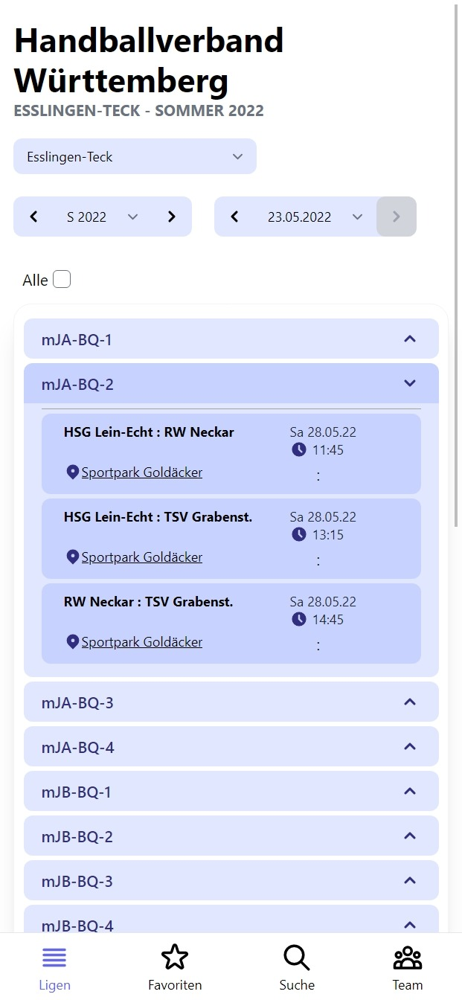
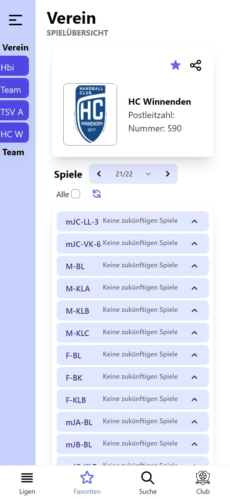
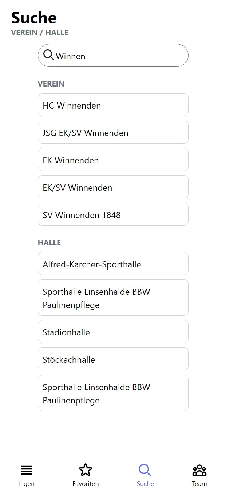
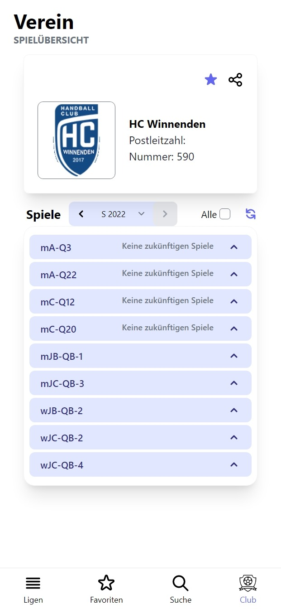
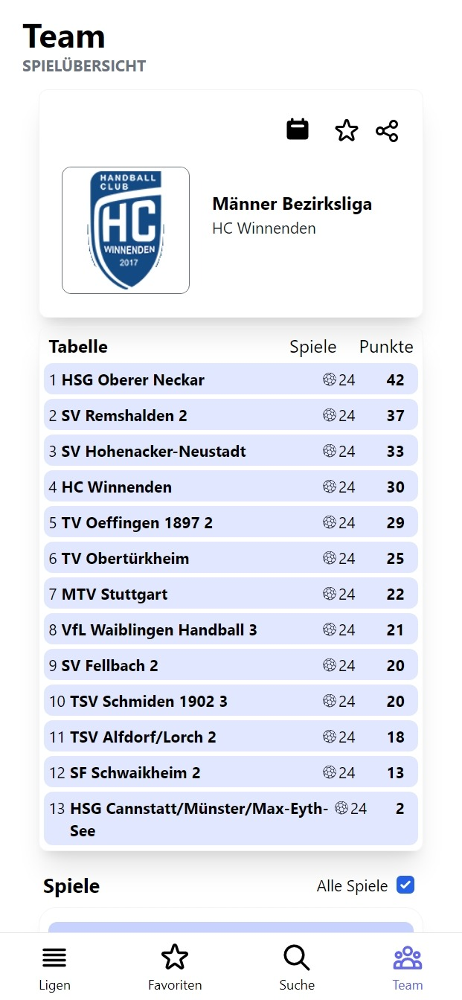
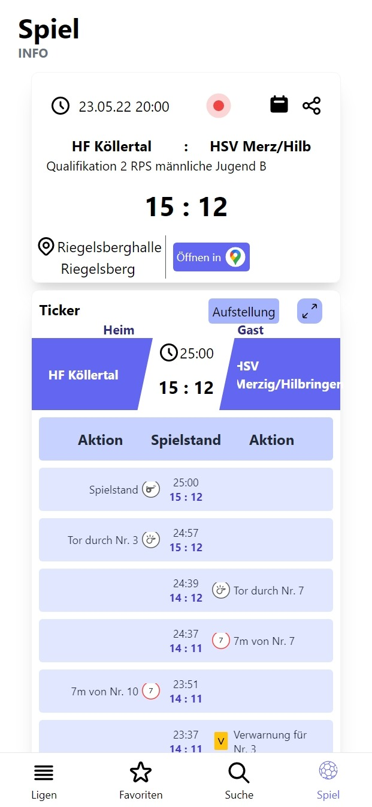
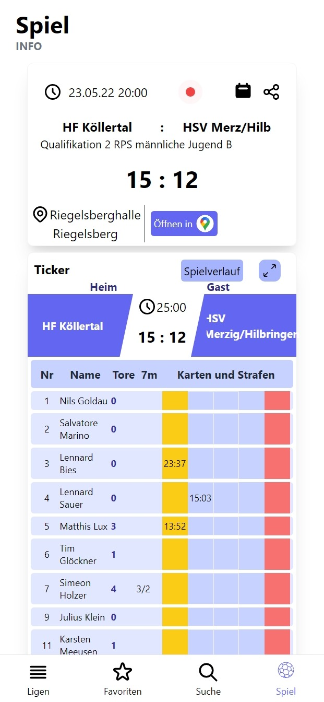
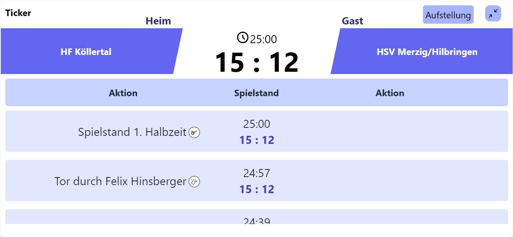

<div id="top"></div>

[![Contributors][contributors-shield]][contributors-url]
[![Forks][forks-shield]][forks-url]
[![Stargazers][stars-shield]][stars-url]
[![Issues][issues-shield]][issues-url]
[![MIT License][license-shield]][license-url]
[![LinkedIn][linkedin-shield]][linkedin-url]


<!-- PROJECT LOGO -->
<br />
<div align="center">
  <a href="https://github.com/faupau03/h4y">
    
  </a>

<h3 align="center">H4Y - Handball 4 You</h3>

  <p align="center">
    Matchoverview, Liveticker and Club and Gym search
    <br />
    <a href="https://github.com/faupau03/h4y"><strong>Explore the docs »</strong></a>
    <br />
    <br />
    <a href="https://h4y.netlify.app">View Demo</a>
    ·
    <a href="https://github.com/faupau03/h4y/issues">Report Bug</a>
    ·
    <a href="https://github.com/faupau03/h4y/issues">Request Feature</a>
  </p>
</div>


<!-- TABLE OF CONTENTS -->
<details>
  <summary>Table of Contents</summary>
  <ol>
    <li>
      <a href="#about-the-project">About The Project</a>
      <ul>
        <li><a href="#built-with">Built With</a></li>
      </ul>
    </li>
    <li>
      <a href="#getting-started">Getting Started</a>
      <ul>
        <li><a href="#prerequisites">Prerequisites</a></li>
        <li><a href="#installation">Installation</a></li>
      </ul>
    </li>
    <li><a href="#usage">Usage</a></li>
    <li><a href="#roadmap">Roadmap</a></li>
    <li><a href="#contributing">Contributing</a></li>
    <li><a href="#license">License</a></li>
    <li><a href="#contact">Contact</a></li>
    <li><a href="#acknowledgments">Acknowledgments</a></li>
  </ol>
</details>


<!-- ABOUT THE PROJECT -->
## About The Project

<p>
  
  
  
  
  
  
  
  
</p>

This app makes it easy for everyone to check match results, view the life ticker of a game or search for their favorites teams.

<p align="right">(<a href="#top">back to top</a>)</p>


### Built With

* [Vue.js](https://vuejs.org/)
* [TailwindCSS](https://tailwindcss.com/)

<p align="right">(<a href="#top">back to top</a>)</p>


<!-- GETTING STARTED -->
## Getting Started

This is an example of how you may give instructions on setting up your project locally.
To get a local copy up and running follow these simple example steps.

### Prerequisites

This requirements must be met to install H4Y.
* npm
  ```sh
  npm install npm@latest -g
  ```

### Installation

1. Clone the repo
   ```sh
   git clone https://github.com/faupau03/h4y.git
   ```
2. Install NPM packages
   ```sh
   npm install
   ```
3. Build the project
   ```sh
   npm run build
   ```

<p align="right">(<a href="#top">back to top</a>)</p>


<!-- USAGE EXAMPLES -->
## Usage

You can now run the app with the following command
```sh
   npm run serve
   ```
You can access your H4Y instance on port 80.

_For other configurations, please refer to the [Documentation](https://github.com/faupau03/h4y)_

<p align="right">(<a href="#top">back to top</a>)</p>


<!-- ROADMAP -->
## Roadmap

- [ ] Home tab with recommendations, overview of your favorites and more
- [ ] Push notifications of favorite team is in a match and link to ticker
- [ ] Offline capabilities
    - [ ] Offline host
    - [ ] Offline API

See the [open issues](https://github.com/faupau03/h4y/issues) for a full list of proposed features (and known issues).

<p align="right">(<a href="#top">back to top</a>)</p>


<!-- CONTRIBUTING -->
## Contributing

Contributions are what make the open source community such an amazing place to learn, inspire, and create. Any contributions you make are **greatly appreciated**.

If you have a suggestion that would make this better, please fork the repo and create a pull request. You can also simply open an issue with the tag "enhancement".
Don't forget to give the project a star! Thanks again!

1. Fork the Project
2. Create your Feature Branch (`git checkout -b feature/AmazingFeature`)
3. Commit your Changes (`git commit -m 'Add some AmazingFeature'`)
4. Push to the Branch (`git push origin feature/AmazingFeature`)
5. Open a Pull Request

<p align="right">(<a href="#top">back to top</a>)</p>


<!-- MARKDOWN LINKS & IMAGES -->
<!-- https://www.markdownguide.org/basic-syntax/#reference-style-links -->
[contributors-shield]: https://img.shields.io/github/contributors/faupau03/h4y.svg?style=for-the-badge
[contributors-url]: https://github.com/faupau03/h4y/graphs/contributors
[forks-shield]: https://img.shields.io/github/forks/faupau03/h4y.svg?style=for-the-badge
[forks-url]: https://github.com/faupau03/h4y/network/members
[stars-shield]: https://img.shields.io/github/stars/faupau03/h4y.svg?style=for-the-badge
[stars-url]: https://github.com/faupau03/h4y/stargazers
[issues-shield]: https://img.shields.io/github/issues/faupau03/h4y.svg?style=for-the-badge
[issues-url]: https://github.com/faupau03/h4y/issues
[license-shield]: https://img.shields.io/github/license/faupau03/h4y.svg?style=for-the-badge
[license-url]: https://github.com/faupau03/h4y/blob/master/LICENSE
[linkedin-shield]: https://img.shields.io/badge/-LinkedIn-black.svg?style=for-the-badge&logo=linkedin&colorB=555
[linkedin-url]: https://linkedin.com/in/faupau
[product-screenshot]: images/screenshot.png


## Author

👤 **Paul Paffe**

* Github: [@faupau03](https://github.com/faupau03)
* LinkedIn: [@faupau](https://linkedin.com/in/faupau)

## Show your support

Give a ⭐️ if this project helped you!

## 📝 License

Copyright © 2022 [Paul Paffe](https://github.com/faupau03).<br />
This project is [MIT](https://opensource.org/licenses/MIT) licensed.
See `LICENSE` for more information.

<p align="right">(<a href="#top">back to top</a>)</p>
